# 👋 Hola, soy Ivan Madera

### Software Engineer · Backend · Middleware

---

## 👨‍💻 Sobre mí

Soy **Software Engineer** enfocado principalmente en el desarrollo **Backend, Middleware y APIs**, con experiencia trabajando en sistemas empresariales, integraciones y optimización de servicios.

Me interesa construir soluciones que no solo funcionen, sino que sean **mantenibles, eficientes y escalables**, procurando mantener un equilibrio entre arquitectura, rendimiento y experiencia de desarrollo.

También tengo experiencia en **desarrollo Frontend**, área en la que comencé mi camino profesional y que actualmente continúo explorando para complementar mi perfil como desarrollador.

---

## 💼 Experiencia profesional

### Macropay · Mérida, Yucatán, México

**Desarrollador Middleware · Agosto 2022 – Actualidad**

Actualmente formo parte del equipo de Middleware, participando en el diseño, desarrollo y evolución de servicios que conectan distintos sistemas y procesos de negocio. Durante este tiempo he trabajado en el desarrollo de una plataforma **MDM para la gestión segura de más de 300,000 dispositivos empresariales**, incorporando monitoreo y alertas, optimizando procesos de actualización y contribuyendo a reducir aproximadamente **20% los tiempos de respuesta del Backend**. También he participado en la **migración y refactorización de sistemas monolíticos hacia arquitecturas basadas en microservicios**, utilizando principalmente **Node.js y AWS**, así como en la optimización de procesos de base de datos mediante procedimientos almacenados, logrando reducciones de hasta **35% en tiempos de ejecución** en procesos específicos. Mi trabajo también involucra el desarrollo e integración de APIs, servicios Backend y soluciones orientadas a dispositivos IoT.

**Tecnologías:** `Node.js` · `TypeScript` · `Express` · `MySQL` · `Docker` · `AWS` · `IoT Core` · `Cognito` · `S3`

---

## 🏗️ Actualmente construyendo

### 🖥️ NovaHub

[**NovaHub-Downloader →**](https://github.com/IvanMadera/NovaHub-Downloader)

Una aplicación de escritorio desarrollada con **Python + PySide6**, enfocada en centralizar diferentes herramientas y flujos de descarga dentro de una misma interfaz.

Entre sus principales funcionalidades se encuentran herramientas para trabajar con plataformas como:

`YouTube` · `TikTok` · `Instagram` · `Facebook` · `X` · `Spotify`

Además de un descargador universal basado en `yt-dlp` y otras utilidades.

---

## 🔬 Investigación

### Detección de síntomas de salud mental mediante lenguaje escrito

Participé como **coautor de un artículo científico** relacionado con la detección de síntomas de salud mental a partir del lenguaje escrito de estudiantes universitarios utilizando una plataforma de microblogging.

El trabajo fue presentado en **WITCOM 2023** y posteriormente publicado como parte de la serie *Communications in Computer and Information Science* de Springer.

---

## 🛠️ Stack tecnológico

---

## 📊 Estadísticas de GitHub

 

---

## 🏆 Logros de GitHub

---

## 🐍 Actividad en GitHub

<picture>
  <source media="(prefers-color-scheme: dark)" srcset="./profile/github-snake-dark.svg" />
  <source media="(prefers-color-scheme: light)" srcset="./profile/github-snake.svg" />
  
</picture>

---

## 🎯 Currículum

Puedes consultar mis currículums directamente desde este repositorio:

---

## 🫂 Gracias por llegar hasta aquí

### 🙌 Si llegaste hasta aquí, no me queda más que agradecerte por visitar mi perfil de GitHub.

Espero que alguno de mis proyectos, ideas o experimentos te resulte interesante.

**¡Gracias por pasar por aquí! 🚀**

 

`Construyendo · aprendiendo · experimentando · mejorando`

